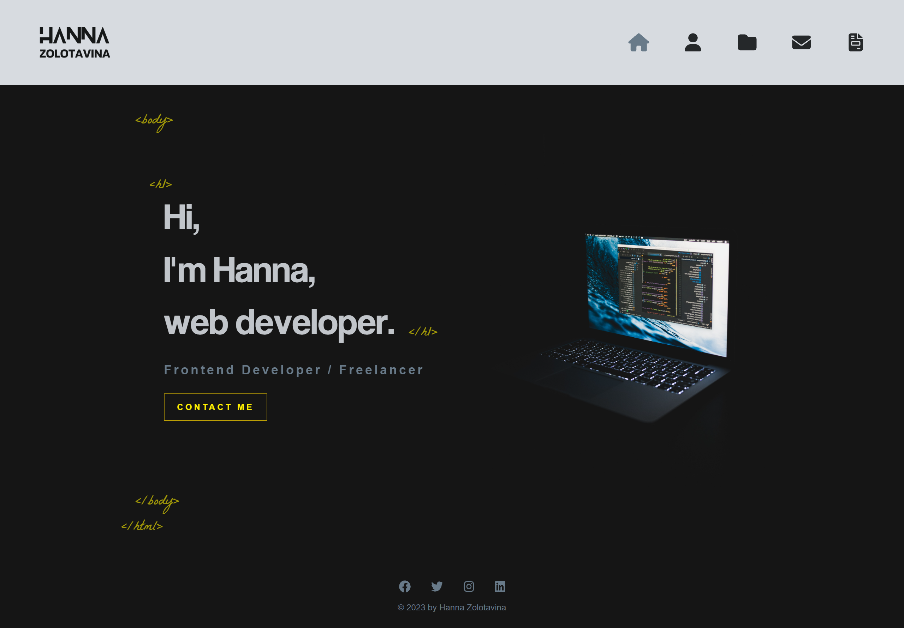
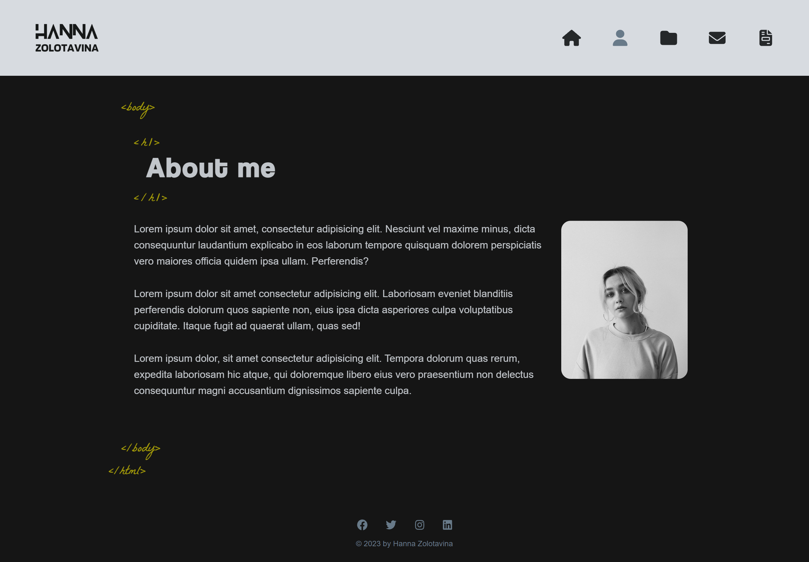
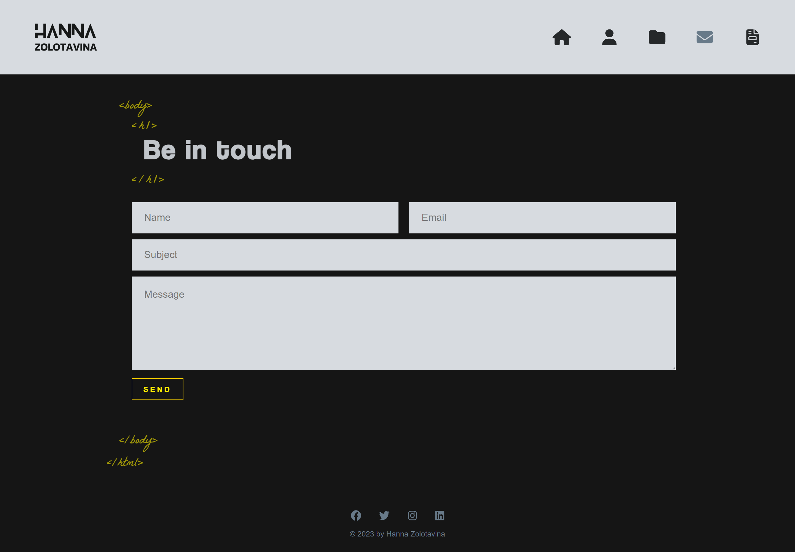

# Portfolio

[](https://opensource.org/licenses/MIT)
  
## Description
  
A single-page application portfolio for a web developer built with React and deployed to GitHub Pages.

[Deployed Application](https://hannazo.github.io/regular-web-celery/)
  
## Table of Contents

- [Webpage Preview](#webpage-preview)
- [Installation](#installation)
- [Technologies](#Technologies)
- [Credits](#credits)
- [License](#license)
  
## Webpage Preview
  
Home Page



About Page



Contact Page



  
## Installation
  
To install necessary dependencies, run 'npm i' command:
```
npm i
```
To build your app, run 'npm run build' command:
```
npm run build
```
To deploy your app, run 'npm run deploy' command:
```
npm run deploy
```

## Technologies
  
* [React](https://react.dev/) 
* [EmailJs](https://www.emailjs.com/)
* [Fort Awesome](https://fortawesome.com/)
* [Animate.css](https://animate.style/)
* [Sass](https://sass-lang.com/)

## Credits

I've used the following resources: 

[React Project Tutorial](https://youtu.be/bmpI252DmiI)
I followed this tutorial to initialise react app, install necessary npm packages, add animation to the text and set up emailjs for contact page.
  
## License
    
This project is licensed under the [MIT](https://opensource.org/licenses/MIT) license.